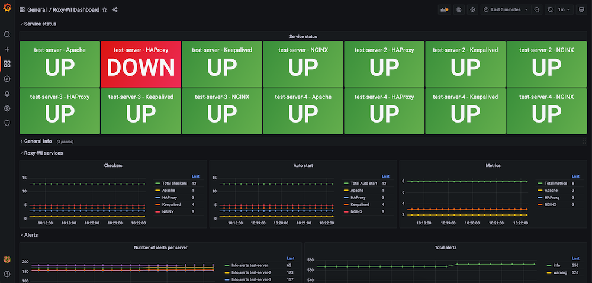

# Roxy-WI Prometheus exporter

Roxy-WI Prometheus exporter is on beta now. If you have a lack of metrics or faced
with any problems, please [write to us](https://roxy-wi.org/contacts).

Roxy-WI Prometheus exporter exposes next metrics:

```
# HELP roxy_wi_services_total How many services
# TYPE roxy_wi_services_total gauge
roxy_wi_services_total{name="HAProxy",service="haproxy"} 4.0
roxy_wi_services_total{name="NGINX",service="nginx"} 1.0
roxy_wi_services_total{name="Keepalived",service="keepalived"} 4.0
roxy_wi_services_total{name="Apache",service="apache"} 1.0
# HELP roxy_wi_server_total How many servers
# TYPE roxy_wi_server_total gauge
roxy_wi_server_total 5.0
# HELP roxy_wi_enabled_server_total How many enabled servers
# TYPE roxy_wi_enabled_server_total gauge
roxy_wi_enabled_server_total 5.0
# HELP roxy_wi_virtual_server_total How many virtual servers
# TYPE roxy_wi_virtual_server_total gauge
roxy_wi_virtual_server_total 2.0
# HELP roxy_wi_user_total How many users
# TYPE roxy_wi_user_total gauge
roxy_wi_user_total 5.0
# HELP roxy_wi_user_by_role Users by roles
# TYPE roxy_wi_user_by_role gauge
roxy_wi_user_by_role{role="superAdmin"} 1.0
roxy_wi_user_by_role{role="admin"} 0.0
roxy_wi_user_by_role{role="user"} 2.0
roxy_wi_user_by_role{role="guest"} 2.0
# HELP roxy_wi_service_checker_enabled_total How many Checkers are enabled for service
# TYPE roxy_wi_service_checker_enabled_total gauge
roxy_wi_service_checker_enabled_total{name="HAProxy",service="haproxy"} 3.0
roxy_wi_service_checker_enabled_total{name="NGINX",service="nginx"} 5.0
roxy_wi_service_checker_enabled_total{name="Keepalived",service="keepalived"} 4.0
roxy_wi_service_checker_enabled_total{name="Apache",service="apache"} 1.0
# HELP roxy_wi_checker_enabled_total How many Checkers are enabled
# TYPE roxy_wi_checker_enabled_total gauge
roxy_wi_checker_enabled_total 13.0
# HELP roxy_wi_checker_service_status Service status
# TYPE roxy_wi_checker_service_status gauge
roxy_wi_checker_service_status{check_type="service",hostname="test-server",ip="10.0.0.205",name="Apache",service="apache"} 1.0
roxy_wi_checker_service_status{check_type="service",hostname="test-server",ip="10.0.0.205",name="NGINX",service="nginx"} 1.0
roxy_wi_checker_service_status{check_type="service",hostname="test-server",ip="10.0.0.205",name="Keepalived",service="keepalived"} 1.0
roxy_wi_checker_service_status{check_type="service",hostname="test-server",ip="10.0.0.205",name="HAProxy",service="haproxy"} 0.0
roxy_wi_checker_service_status{check_type="service",hostname="test-server-4",ip="127.0.0.1",name="NGINX",service="nginx"} 1.0
roxy_wi_checker_service_status{check_type="service",hostname="test-server-4",ip="127.0.0.1",name="Apache",service="apache"} 1.0
roxy_wi_checker_service_status{check_type="service",hostname="test-server-4",ip="127.0.0.1",name="HAProxy",service="haproxy"} 1.0
roxy_wi_checker_service_status{check_type="service",hostname="test-server-4",ip="127.0.0.1",name="Keepalived",service="keepalived"} 1.0
# HELP roxy_wi_service_checker_alert Number of alerts per server
# TYPE roxy_wi_service_checker_alert gauge
roxy_wi_service_checker_alert{hostname="test-server",ip="10.0.0.205",level="info"} 65.0
roxy_wi_service_checker_alert{hostname="test-server",ip="10.0.0.205",level="warning"} 2.0
roxy_wi_service_checker_alert{hostname="test-server-2",ip="127.0.0.2",level="info"} 175.0
roxy_wi_service_checker_alert{hostname="test-server-2",ip="127.0.0.2",level="warning"} 186.0
roxy_wi_service_checker_alert{hostname="test-server-3",ip="127.0.0.4",level="info"} 159.0
roxy_wi_service_checker_alert{hostname="test-server-3",ip="127.0.0.4",level="warning"} 175.0
roxy_wi_service_checker_alert{hostname="test-server-4",ip="127.0.0.1",level="info"} 165.0
roxy_wi_service_checker_alert{hostname="test-server-4",ip="127.0.0.1",level="warning"} 171.0
roxy_wi_service_checker_alert{hostname="test-server-VIP",ip="10.0.0.24",level="info"} 1.0
roxy_wi_service_checker_alert{hostname="test-server-VIP",ip="10.0.0.24",level="warning"} 0.0
# HELP roxy_wi_service_checker_alert_total Total alerts
# TYPE roxy_wi_service_checker_alert_total gauge
roxy_wi_service_checker_alert_total{level="info"} 565.0
roxy_wi_service_checker_alert_total{level="warning"} 534.0
# HELP roxy_wi_service_auto_start_enabled_total How many Auto start are enabled for service
# TYPE roxy_wi_service_auto_start_enabled_total gauge
roxy_wi_service_auto_start_enabled_total{name="HAProxy",service="haproxy"} 3.0
roxy_wi_service_auto_start_enabled_total{name="NGINX",service="nginx"} 5.0
roxy_wi_service_auto_start_enabled_total{name="Keepalived",service="keepalived"} 4.0
roxy_wi_service_auto_start_enabled_total{name="Apache",service="apache"} 1.0
# HELP roxy_wi_auto_start_enabled_total How many Auto start are enabled
# TYPE roxy_wi_auto_start_enabled_total gauge
roxy_wi_auto_start_enabled_total 13.0
# HELP roxy_wi_service_metrics_enabled_total How many Metrics are enabled for service
# TYPE roxy_wi_service_metrics_enabled_total gauge
roxy_wi_service_metrics_enabled_total{name="HAProxy",service="haproxy"} 3.0
roxy_wi_service_metrics_enabled_total{name="NGINX",service="nginx"} 3.0
roxy_wi_service_metrics_enabled_total{name="Apache",service="apache"} 2.0
# HELP roxy_wi_metrics_enabled_total How many Metrics are enabled
# TYPE roxy_wi_metrics_enabled_total gauge
roxy_wi_metrics_enabled_total 8.0
```

# Installation

To install the exporter:

```angular2html
git clone https://github.com/hap-wi/roxy-wi-prometheus-exporter.git
cd roxy-wi-prometheus-exporter
pip3 install -r requirements.txt
chmod +x prometheus_exporter.py
mv prometheus_exporter.py /var/www/haproxy-wi/app/tools/
```

Add to Prometheus config:
```angular2html
  - job_name: roxy-wi
    metrics_path: /
    scrape_interval: 60s
    static_configs:
    - targets:
      - localhost:9900
```
and reload it

# Run:
```angular2html
cd /var/www/haproxy-wi/app
tools/prometheus_exporter.py &
```

# Dashboard
There is [dashboard for Grafana](https://grafana.com/grafana/dashboards/16713)

